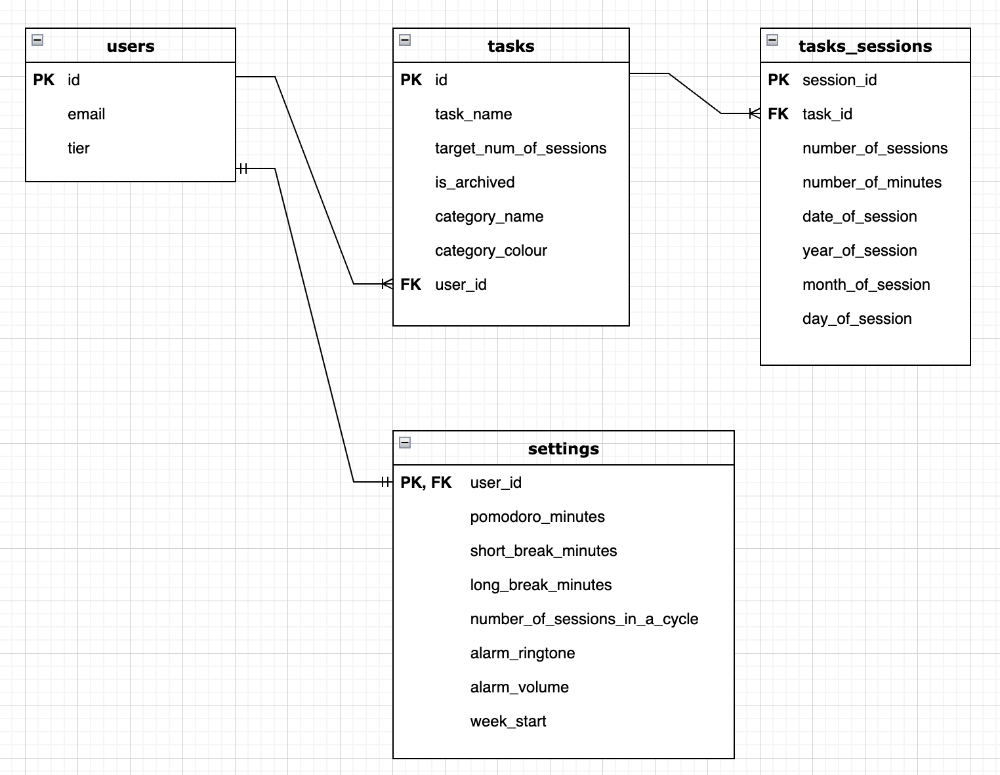

# Pomogrids

Pomogrids is a productivity tool that includes a pomodoro timer and a heat map which tracks the number of hours worked daily. It hopes to help users improve focus and accountability for their day to day learning! Its inspired by the Pomodoro Technique (a time management method) and Github's contribution heat map.

This repository is for the backend. You may find the frontend repository [HERE](https://github.com/awhuiyun/pomogrids).

<kbd> </kbd>

## Technologies used

1. Typescript
2. Express
3. MySQL for database
4. Firebase Authentication

## ERD

<kbd> </kbd>

# Instructions on installation and running Pomogrids

1. npm i
2. Set up MySQL database locally.
3. Create a firebase project, register your app and enable Google sign-in method in your console. Check out documentation [HERE](https://firebase.google.com/docs/auth/web/google-signin).
4. Create your environment variables in .env.local file on pomogrids repo. You may refer to .env.local.example file for the variables needed.
5. Create your environment variables in .env file on pomogrids-server repo. You may refer to .env.example file for the variables needed. Refer to documentation [HERE](https://firebase.google.com/docs/admin/setup) on initializing the Firebase SDK in non-Google environments.
6. DB creation SQL file available in schema.sql file in pomogrids-server repo.
