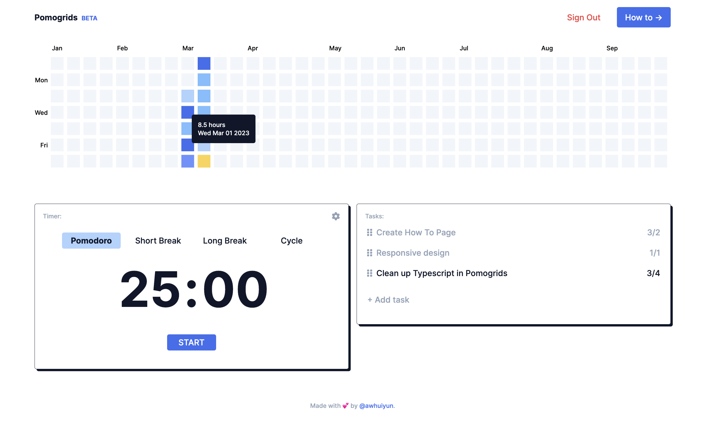

# Pomogrids

Pomogrids is a productivity tool that includes a pomodoro timer and a heat map which tracks the number of hours worked daily. It hopes to help users improve focus and accountability for their day to day learning! Its inspired by the Pomodoro Technique (a time management method) and Github's contribution heat map. Check it out [HERE](https://www.pomogrids.com)!

This is a fullstack project developed in 10 days (27th Feb - 9th Mar'23), as part of my capstone project in General Assembly's Software Engineering course.

This repository is for the backend. You may find the frontend repository [HERE](https://github.com/awhuiyun/pomogrids).

<kbd> </kbd>

## Technologies used

1. Typescript
2. Next.js (React)
3. Express
4. MySQL
5. Firebase Authentication
6. D3.js for building the heat map
7. Zustand for state management
8. Howler for audio
9. Axios for API calls
10. React uuid for generating unique keys for each task
11. Tailwind for styling
12. Font Awesome for icons

## Installation

1. npm i
2. Set up MySQL database locally.
3. Create a firebase project, register your app and enable Google sign-in method in your console. Check out documentation [HERE](https://firebase.google.com/docs/auth/web/google-signin).
4. Create your environment variables in .env.local file on pomogrids repo. You may refer to .env.local.example file for the variables needed.
5. Create your environment variables in .env file on pomogrids-server repo. You may refer to .env.example file for the variables needed. Refer to documentation [HERE](https://firebase.google.com/docs/admin/setup) on initializing the Firebase SDK in non-Google environments.
6. DB creation SQL file available in schema.sql file in pomogrids-server repo.

# Reflections

<strong>Motivation of building Pomogrids</strong>

1. I've been a fan of the pomodoro time management technique as well as Github's calendar heat map, hence excited to merge both into a product that I will use/have been using for the past weeks.
2. A great project that may seem simple (one page), yet technically and logically challenging! Pushed me to think about how to write clean code - Example, using reusable components for modals, different forms, menu items, task items, buttons etc. Or, what's the best way to execute the timer logic without repetition (in what scenarios does a Start/Stop/Pause button need to appear? How do I best execute the cycle logic and make it dynamic?).
3. Exposed me to use new technologies that I've been interested in - Typescript, Next.js, Firebase authentication, D3.js. I'm currently rebuilding the production version with Next.js API for server (for exposure and learning), Prisma (to learn ORMs), Planet Scale (MySQL) (for easier deployment of db), Stripe for checkout.

<strong>General approach</strong>

1. Clean code
2. Minimize API calls and utilize local states to make the Pomogrids faster and nicer to use. With each user input (create new task etc), I maintained 2 sets of data (db and local states) so I did not have to run API calls just to update the site. This makes changes instantaneous.

<strong>Key learning</strong>

1. Reading documentation and learning on your own (outside a bootcamp setting) is challenging and a skill all in all! It was honestly overwhelming, yet incredibly satisfying, to learn new technologies and concepts on your own. You may feel overwhelmed with the numorous tutorials but learn to embrace the uncertainty and enjoy the process. Definitely a rewarding process of learning Typescript, Next.js, Firebase auth and D3.js.
